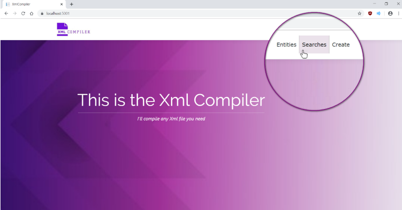
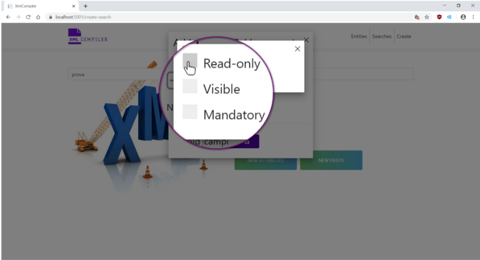
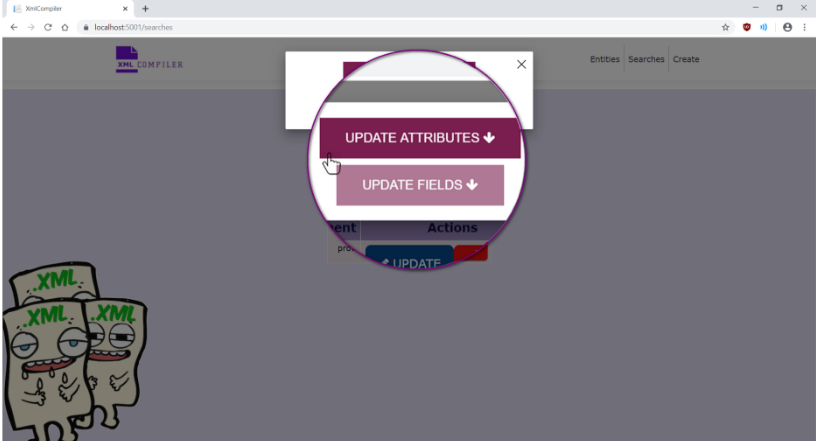

<!-- PROJECT SHIELDS -->
[](https://github.com/FedericaPaoli1/XmlCompiler/LICENSE)


<!-- PROJECT LOGO -->
<br />
<p align="center">
  <a href="https://github.com/FedericaPaoli1/XmlCompiler">
    
  </a>
 
  <h3 align="center">XmlCompiler</h3>

  <p align="center">
    XML/TypeScript components configuration for automatic form generation
    <br />
  </p>
</p>


<!-- TABLE OF CONTENTS -->
<details open="open">
  <summary>Table of Contents</summary>
  <ol>
    <li>
      <a href="#about-the-project">About The Project</a>
      <ul>
        <li><a href="#built-with">Built With</a></li>
      </ul>
    </li>
    <li>
      <a href="#getting-started">Getting Started</a>
      <ul>
        <li><a href="#prerequisites">Prerequisites</a></li>
        <li><a href="#installation">Installation</a></li>
      </ul>
    </li>
    <li><a href="#usage">Usage</a></li>
    <li><a href="#license">License</a></li>
    <li><a href="#contact">Contact</a></li>
  </ol>
</details>


<!-- ABOUT THE PROJECT -->
## About The Project

XmlCompiler is a project developed for the bachelor's thesis at the University of Florence (academic year 2018-2019). 
XmlCompiler is a Web App that allows you to compile Xml files, or create new ones, by providing an interface that acts as a link 
between the operations carried out on the file system and the data entered by you in order to create a new Xml file or modify an existing one. 
It does not receive any specific input data, but it can generate the corresponding XML file by feeding it any parameter.

### Built With

* [ASP.NET Core](https://docs.microsoft.com/en-us/aspnet/core/?view=aspnetcore-5.0)
* [TypeScript](https://www.typescriptlang.org/)
* [HTML](https://www.html.it/)
* [C#](https://docs.microsoft.com/it-it/dotnet/csharp/)
* [JavaScript](https://www.javascript.com/)
* [Angular](https://angular.io/)
* [Visual Studio 2017](https://visualstudio.microsoft.com/it/)


<!-- GETTING STARTED -->
## Getting Started

### Prerequisites

* [ASP.NET Core](https://docs.microsoft.com/en-us/aspnet/core/?view=aspnetcore-5.0)

### Installation

1. Clone the repo
   ```sh
   git clone https://github.com/FedericaPaoli1/XmlCompiler.git
   ```
2. Run the application on a browser

<!-- USAGE EXAMPLES -->
## Usage
* Starting from the homepage of the app, it will be possible to make three choices, located to the top right of the navigation bar.
<br />
<p align="center">
  
</p>
<br />
<br />
<br />

* By clicking on the first button, "Entities", we will be redirected to the page containing the list of all the Xml files contained in the file system, relating to the Entity file type.
  This type of file constitutes the elements displayed in the interface.
<br />
<p align="center">
  
</p>
<br />
<p align="center">
  
</p>
<br />
<br />
<br />

* By clicking on the second button, "Searches", we will be redirected to the page containing the list of all the Xml files contained in the file system, relating to the Search file type.
  This type of file represents the filters with which searches are carried out, at interface level, on Entities
<br />
<p align="center">
  
</p>
<br />
<p align="center">
  
</p>
<br />
<br />
<br />

* Clicking on the "Create" button, it will take you to a page where you can choose between the two types of file to be created.
<br />
<p align="center">
  
</p>
<br />
<p align="center">
  
</p>
<br />
<br />
<br />

* Selecting one of the two buttons, e.g. the first one, "Create a new search", it will open a page allowing you to insert the Element, i.e. the one that will be the root and the name of the Xml file.
<br />
<p align="center">
  
</p>
<br />
<p align="center">
  
</p>
<br />
<br />
<br />


* If we try to type the word "prova" as the Element text, we will see that the "save", "new attributes" and "new fields" buttons are enabled and becoming brighter in colour.
<br />
<p align="center">
  
</p>
<br />
<br />
<br />


* There is also a "reset" button. This allows you to delete the text you have written, restoring the initial text box. 
  If, for example, you write "provaaa" and then realise that you have written something wrong or that you would like to change, you can click on the "reset" button so that you can write the correct word.
<br />
<p align="center">
  
</p>
<br />
<p align="center">
  
</p>
<br />
<p align="center">
  
</p>
<br />
<br />
<br />


* After entering the correct word as Element text, clicking on "save", it will open a confirmation window. 
  It will then be possible to confirm the inserted element and create an Xml file with only the presence of what has been entered, i.e. only the root, or it will be possible to continue inserting further elements, i.e. attributes and/or fields.
<br />
<p align="center">
  
</p>
<br />
<p align="center">
  
</p>
<br />
<br />
<br />


* If you choose to continue inserting more, click on the red button marked "No, I want to continue inserting attributes and fields".
<br />
<p align="center">
  
</p>
<br />
<br />
<br />


* At this point, clicking on the "New attributes" button to insert new attributes it will open a new window allowing you to enter the key and value of a new attribute.

<br />
<p align="center">
  
</p>
<br />
<br />
<br />

* As an example, we will enter "attributo1" as the key and "uno" as the value of our new attribute.

<br />
<p align="center">
  
</p>
<br />
<br />
<br />


* You can also add more than one attribute by clicking on the "+" button at the top of the window.

<br />
<p align="center">
  
</p>
<br />
<br />
<br />


* Two more text boxes will be provided, one for entering the key and another for entering the value of the new attribute.

<br />
<p align="center">
  
</p>
<br />
<br />
<br />


* When inserting a new attribute with key "attributo3" and value "tre", we realise that it is not the attribute we want. 
  You can therefore delete it by clicking on the eraser button.

<br />
<p align="center">
  
</p>
<br />
<p align="center">
  
</p>
<br />
<br />
<br />


* By clicking on the "+" button again, we will enter the right attribute in the empty boxes.

<br />
<p align="center">
  
</p>
<br />
<br />
<br />


* We can now save the entered attributes and proceed to insert the fields by clicking on the "New fields" button.

<br />
<p align="center">
  
</p>
<br />
<p align="center">
  
</p>
<br />
<br />
<br />


* Again, a dialogue box will allow new fields to be entered using the same buttons.

<br />
<p align="center">
  
</p>
<br />
<br />
<br />


* We will insert the first field named "campo1", with the identifier of the group to which "campi" belongs.

<br />
<p align="center">
  
</p>
<br />
<br />
<br />


* In addition, by clicking on the "Add option" button, it will be possible to enter additional characteristics of the field, which define whether it is a read-only field, visible or mandatory.

<br />
<p align="center">
  
</p>
<br />
<br />
<br />


* When one or more elements are not selected, it means that, being Boolean values, they will appear in the Xml file with the false value, vice-versa they will appear with the true value.

<br />
<p align="center">
  
</p>
<br />
<br />
<br />


* We will select the "Read-only" element in this case.

<br />
<p align="center">
  
</p>
<br />
<p align="center">
  
</p>
<br />
<br />
<br />


* If you wish, you can add another field with the name "campo2" and group id "campi" and save it.

<br />
<p align="center">
  
</p>
<br />
<br />
<br />


* Once we have filled in what we need to create the Xml file, we can click on the "yes and save" button in the confirmation window.
  Once saved, in the file system, in this case, in the XmlCompiler/XmlFiles/Searches/ directory, the file prova.xml will appear and we will be redirected to the list of all Xml files relating to Searches, which currently also contains the file "prova".
  Here we can edit or delete the file.

<br />
<p align="center">
  
</p>
<br />
<br />
<br />


* By clicking on the "Update" button, a window for updating attributes or fields will be presented. 

<br />
<p align="center">
  
</p>
<br />
<p align="center">
  
</p>
<br />
<br />
<br />


* By selecting "Update attributes", it will be possible to write the key of an attribute whose value we would like to change, or write a new attribute to add to the attributes of the "prova" file, by clicking on the "New update" button.

<br />
<p align="center">
  
</p>
<br />
<p align="center">
  
</p>
<br />
<br />
<br />


* As in the case of creation, it will be possible to remove incorrect or unwanted attributes and, once the necessary changes have been made, it will be possible to save.

<br />
<p align="center">
  
</p>
<br />
<br />
<br />


* The same can be done by clicking on "Update fields". 
  You will have the possibility to write the name of a field whose group identifier or options you want to change by clicking on the button "More options" button.

<br />
<p align="center">
  
</p>
<br />
<p align="center">
  
</p>
<br />
<p align="center">
  
</p>
<br />
<br />
<br />


* The options are the same as for creation and have the same rules for selection or not. New fields can also be added by clicking on the "New update" button.

<br />
<p align="center">
  
</p>
<br />
<br />
<br />


* To close the different windows, you can click on the "X" button or directly on the "save" button.

<br />
<p align="center">
  
</p>
<br />
<br />
<br />


* If you want to delete the Xml file from the file system, you will be able to click on the "delete" button, deleting it from both the list and the file system.

<br />
<p align="center">
  
</p>
<br />
<p align="center">
  
</p>
<br />
<p align="center">
  
</p>
<br />
<br />
<br />


<!-- LICENSE -->
## License

Distributed under the MIT License. See `LICENSE` for more information.


<!-- CONTACT -->
## Contact

Federica Paoli' - federicapaoli1@gmail.com

Project Link: [https://github.com/FedericaPaoli1/XmlCompiler](https://github.com/FedericaPaoli1/XmlCompiler)
